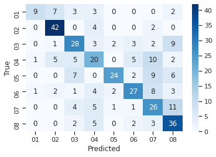
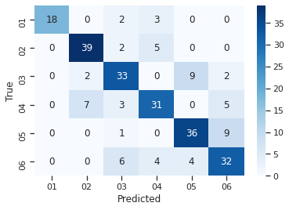

Trabajo práctico número 2 - Aprendizaje
Automático                                 
Grupo 12: Carrasco, Roel, Sotelo

UNIVERSIDAD DE BUENOS AIRES

FACULTAD DE CS. EXACTAS Y NATURALES

MAESTRÍA EN EXPLOTACIÓN DE DATOS Y DESCUBRIMIENTO
DE CONOCIMIENTO

TRABAJO PRÁCTICO ENTREGABLE II  
Ensambles

### 

### Aprendizaje Automático 

1er cuatrimestre de 2021

Grupo 12

Integrantes: Lisandro
Carrasco, Macarena Roel, Santiago
Sotelo

### 

-----

### 

### Resumen

Los métodos de
ensambles tienen una
multitud de usos en el área de la clasificación de datos y pueden ser
muy versátiles dependiendo de los hiperparámetros que tomen.  
En este trabajo, se utilizan métodos de ensamble para analizar datos
obtenidos a partir del procesamiento de dos conjuntos de datos, uno con
audios hablados, otro de audios cantados, etiquetados con las emociones
que los actores que protagonizan las grabaciones pretendían transmitir.
A fin de comparar modelos, también se han hecho experimentos con un
conjunto de datos que integra ambos tipos.  
Se buscó generar un modelo de clasificación supervisada a partir de los
mismos, estudiando las posibilidades de utilizar ensambles del tipo
bagging, como Random Forest, o tipo boosting, como AdaBoost, realizando
una búsqueda
aleatoria de
hiperparámetros y generando la división del set de entrenamiento y
validación con un k-fold cross validation o un Leave Two Groups Out
cross validation.  
Se obtuvieron mejores resultados (utilizando accuracy como medida de
performance) en la clasificación realizada con
12-fold cross
validation y con el
método Random
Forest.  
Posteriormente se utilizó el modelo Leave 2 Out Cross Validation para
clasificar 12 audios grabados por los miembros del grupo, con una serie
de entonaciones y niveles de ruido diferentes, con emociones etiquetadas
por personas externas al trabajo práctico. Se obtuvo un accuracy de
0.667.

Introducción  
  
Las características auditivas de una oración
pronunciada o cantada por una persona pueden expresar diferentes
emociones humanas. Si bien la idea de ‘emoción’ es un concepto social
complejo, los atributos auditivos pueden describirse detalladamente y
asociarse a diferentes etiquetas que aluden a estas emociones. Esto
puede aplicarse tanto al análisis de conversaciones y discursos, como a
cuestiones musicales. 

El objetivo de este trabajo fue comparar el
rendimiento de diferentes tipos modelos de ensambles para encontrar el
que mejor pudiera etiquetar la emoción transmitida en un archivo de
sonido.  

Los recursos utilizados y las decisiones de
experimentación se encuentran descritas en las secciones “Datos” y
“Metodologías”, discutiendo los resultados obtenidos en “Resultados” y
finalizando el trabajo con algunas valoraciones en la sección
“Conclusiones”.

Datos

  
Para este trabajo se han utilizado dos datasets obtenidos de la base de
datos audiovisual Ryerson (RAVDESS). Concretamente, se han utilizado dos
conjuntos exclusivamente de audios, que contienen las grabaciones de 24
actores pronunciando dos oraciones en inglés estadounidense neutro. Los
nombres de los archivos están compuestos por 14 números descriptivos de
7 atributos que caracterizan el audio.

Esos atributos son ‘modalidad’, en este caso,
siempre audio y representado por el número 03; ‘canal de voz’
(01=hablado, 02=cantado); emoción (01 = neutral, 02 = calmo, 03 =
contento, 04 = triste, 05 = enojado, 06 = temeroso, 07 = disgustado, 08
= sorprendido); ‘intensidad’ (01 = normal, 02 = fuerte); declaración,
tratándose de la oración que se lee en cada audio, (01 = "Kids are
talking by the door", 02 = "Dogs are sitting by the door");
‘repetición’. dado que cada actor lee las oraciones dos veces; y la
numeración del actor, siendo del 01 al 24, siendo los impares
correspondientes a hombres y los pares a mujeres.

Toda la información comprendida en el nombre de cada
archivo ha sido extraída y volcada en un dataframe, en el cual cada
columna es nombrada por uno de estos atributos y sus valores son los
números correspondientes a la descripción anterior. En este caso, si
bien los valores expresados son numéricos, se tratan de variables
categóricas. 

Las clases de la variable
‘emoción’ son las
que se buscarán predecir. En términos de esta categoría objetivo, el
dataset está relativamente balanceado, siendo solo las emociones
‘neutral’, ‘disgustado’ y ‘sorprendido’ las que presentan menos
observaciones que las demás: mientras las otras cinco tienen 376 audios,
estas tienen 188, 192 y 192 respectivamente. Es importante señalar que
en el dataset de audios cantados no se registran observaciones
etiquetadas bajo las últimas dos emociones.  
Además de los metadatos obtenidos a partir de la información de los
títulos, la gran mayoría de las variables utilizadas durante este
trabajo fueron variables acústicas, diferentes atributos obtenidos del
análisis del sonido de cada archivo. Estas variables fueron obtenidas a
partir del paquete open
smile: se tratan de 88 variables que componen
el set de parámetros conocido como Geneva Minimalistic Acoustic
Parameter Set (GeMAPS) y describen la frecuencia, la energía y el
espectro del sonido. Todos estos atributos se han expresado en variables
numéricas reales.  

Estos atributos acústicos se unieron a los metadatos a
partir del nombre del archivo de audio para darle forma a los
conjuntos de
datos que se usarán para modelar. Dado la
diferencia auditiva que puede implicar que unos archivos sean cantados y
otros hablados, así como la disparidad en las emociones etiquetadas,
hemos decidido trabajar con dos dataframes
(‘df\_hablado’ y
‘df\_cantado’), así
como entrenar los modelos posteriores tanto para un tipo de archivo como
para otro. El conjunto de datos ‘df\_hablado’
tuvo una dimensión de 1.440 observaciones y 95
columnas y el conjunto
‘df\_cantado’,
de 1.012 y 95, respectivamente. 

También se generaron 12 datos de audio propio,
etiquetados de igual manera que los obtenidos de la base de
datos.

En todos los casos, estos resultados se han comparado
con los resultados de modelos entrenados sobre un
‘df\_general’ con
ambos tipos de audios, es decir, sobre modelos que se entrenaron tanto
con observaciones habladas como cantadas.

Metodología 

Para predecir las emociones de los audios, se
entrenaron diferentes modelos de ensamble, tanto de bagging
(específicamente, Random
Forest), como de boosting
(AdaBoost). Para
cada modelo, se recurrió a la búsqueda aleatoria de
hiperparámetros.

Para comparar la performance de cada modelo, se tuvo en
cuenta la métrica de
‘accuracy’; se
optó por esta métrica porque interesa una visión general de la cantidad
de casos bien calificados. En este caso, dado que no hay costos
importantes asociados a los tipos de errores o aciertos (no hay errores
peores que otros), no hemos recurrido a otras métricas. Además, como
explica la documentación de scikit
learn, los
RandomForestClassifier
están optimizados para
accuracy \[1,
3\]. 

Si bien en los datos se encontraron algunas diferencias
llamativas con algunas emociones menos representadas en el dataset que
otras, no se consideró que este sea un desbalance lo suficientemente
grave como apelar a múltiples estrategias de balanceo. Entre ellas, se
analizó el uso del parámetro ‘class\_weight’
balanceado para el caso de los árboles, pero no
se utilizó finalmente y puede verse en las matrices de confusión que los
modelos han predecido bien sobre emociones con menos observaciones y no
puede asegurarse que tengan un sesgo mayoritario.  
De igual manera se recurrió al parámetro de
stratify para
asegurar que todas las emociones estuvieran representadas en cada
división de datos. Además, como plantea en ‘An
Introduction to Statistical Learning’ \[15\], la
estrategia de cross
validation \[5\] es una estrategia de
remuestreo en sí misma que permite que las categorías menos
representadas igual sean consideradas, por su repetición, en mayor
cantidad que en el caso de que se entrenara sin esta estrategia.

Para los modelos basados en
bagging (Random Forest) se probaron diferentes hiperparámetros
explorados con RandomizedSearchCV
\[6\], variando la
cantidad de estimadores a usar dentro de cada bosque, la profundidad de
sus árboles y el uso o no de remuestreo con reposición (bootstrap). En
la búsqueda, se han hecho 50 iteraciones, con una cantidad de
estimadores entre 50 y 500 árboles con rangos de 10 y una profundidad
máxima de 8. Para
reducir la cantidad de atributos, se mantuvo el valor automático de
RandomForestClassifier,
que utiliza una cantidad máxima de features equivalente a la
raíz cuadrada de las
variables del dataset. 

También se han entrenado diferentes metamodelos basados
en dos criterios de validación
cruzada, el primer criterio de entrenamiento fue
con 12 folds de validación aleatorios y el segundo con la estrategia
‘Leave2GroupsOuts’
(L2GO) \[7\], separando por grupos de dos
artistas. Este último refleja más fielmente la realidad, al entrenar el
modelo con un set de actores y en cada iteración buscando entrenarlos
con otros no vistos previamente. 

Los hiperparámetros
que mejor performance han arrojado en el caso
del Fandom Rorest fueron: 160 estimadores, con una profundidad máxima de
7 y sin bootstrap, sin ccp\_aplha
y con gini.  
Esta configuración de hiperparámetros ha sido idéntica para los tres
modelos de Random Forest entrenados (es decir, para el modelo hablado,
el cantado y el general). El resto de los
hiperparámetros pueden verse en el notebook entregado. 

Por otro lado, se han comparado estos modelos con un
modelo de boosting
(AdaBoost) \[12, 13,
14\], entrenado en base a árboles de decisión de profundidad 1 y con 12
folds de validación. También se realizó una búsqueda aleatoria de
hiperparámetros, donde se evaluaron entre 50 y 200 estimadores con
rangos de 5, y un learning
rate entre 0 y 1 (este segundo valor se
consideró a sabiendas del potencial de sobreajuste que conlleva, pero
con la intención de explorar diferentes desempeños).  
Los hiperparámetros que han resultado del RandomizedSearchCV para el
modelo entrenado sobre los dos tipos de observaciones, fueron: 115
estimadores y un learning
rate de 0.3 

Por último, los tres integrantes del equipo grabaron
cuatro audios cada uno: dos diciendo la primera frase (“Kids are talking
by the door”) y dos la segunda (“Dogs are sitting by the door”),
introduciendo artificialmente ruido de fondo en un audio de cada frase.
Los doce audios resultantes fueron evaluados por un jurado de tres
personas externo al equipo, cuyo consenso se utilizó como etiqueta de
emoción para los nombres de archivo, que fueron creados respetando lo
estipulado por el set de datos original. Los doce audios resultantes se
encuentran disponibles en:
[https://drive.google.com/file/d/1U9U043Y\_Xf-dDOS1nWGvqhojjk8wwJq\_/](https://www.google.com/url?q=https://drive.google.com/file/d/1U9U043Y_Xf-dDOS1nWGvqhojjk8wwJq_/view?usp%3Dsharing&sa=D&source=editors&ust=1632104798355000&usg=AOvVaw11d3AHDxyDDETKPpBof6If)

Estos audios fueron posteriormente procesados de
igual manera que los obtenidos de la base de datos RAVDESS, extrayendo
su metadata y generando los sets de datos correspondientes.

El mismo luego se utilizó para predecir las
emociones utilizando el Random Forest  generado utilizando Leave 2 Out
Cross Validation.

Resultados 

En base al accuracy, se comprobó un
mejor desempeño de los modelos de
bagging respecto de los de boosting. Sin
embargo, es sabido que un mejor accuracy no es indicador de un mejor
desempeño del modelo en general, ya que evalúa al modelo de la manera
más optimista.

Esto puede explicarse por el tipo de datos con los que
se trabajó y el tipo de modelo que se buscó obtener:
al tratarse de datos con muchas clases, se tiene
mucho ruido estadístico al que hay que controlar \[8, 9\]. Por eso se
decide analizar modelos de clasificación con alta varianza y bajo sesgo,
como los árboles, que pueden tener overfitting para el set de
entrenamiento y tener una mala performance con el set de validación.
Para controlar esta diferencia de performance del modelo entre
diferentes conjuntos de datos, es lógico encontrar un mejor desempeño en
aquel método de ensamble que permita reducir la varianza \[10,
11\].

Esto es lo que se logra utilizando un método de
bagging específico para árboles de decisión, como Random Forest, que
permite entrenar múltiples árboles trabajando con un set de features de
entrada reducido para disminuir la correlación entre los diferentes
modelos generados, obteniendo así un resultado proveniente de la
votación de la multitud de árboles que disminuyan la varianza del
modelo.

Por otra parte, utilizando un modelo de boosting
como AdaBoost, que crea varios árboles de poca profundidad de manera
consecutiva, se busca reducir el bias, lo que es particularmente útil
cuando uno tiene sets de datos altamente desbalanceados. Dado que no es
el caso del set de datos con el que se realizó el trabajo, esperábamos
que la performance de ese modelo fuera menor que la del Random Forest,
supuesto que fue comprobado al realizar los análisis pertinentes.

Todos los mejores modelos de bagging mostraron un mejor
accuracy en la
comparación con los mejores modelos de
boosting, sobre el
conjunto de testeo, para todos los casos de entrenamiento:

  - En el caso de los modelos entrenados únicamente
    sobre audios
    hablados,
    Random Forest tuvo un accuracy de 0.589 sobre su conjunto de testeo
    (todos hablados), mientras que AdaBoost alcanzó un 0.500.
  - En el caso de los modelos entrenados únicamente
    sobre audios
    cantados,
    Random Forest tuvo un accuracy de 0.747 sobre su conjunto de testeo
    (todos cantados), mientras que AdaBoost alcanzó un 0.490.
  - En tanto en los modelos entrenados sobre la
    totalidad de
    los datos, Random Forest también ha presentado mejores resultados,
    testeando sobre ambos tipos de datos por separado:

<!-- end list -->

  - Sobre los datos de testeo cantados, el Random
    Forest tuvo un accuracy de 0.744, mientras que AdaBoost logró el
    mismo 0.483.
  - En tanto sobre los datos de testeo hablados, los
    resultados fueron 0.538 y 0.388, respectivamente 

Algo llamativo se ha dado en la comparación de los
modelos entrenados para datos hablados o datos
cantados. Todos
los modelos han mostrado una mejor performance sobre el dataset de
audios cantados, que sobre el de audios hablados. Incluso cuando el
Random Forest se entrenó sobre la totalidad de las observaciones, el
accuracy prácticamente no ha variado. 

En todos los modelos ha habido un nivel de
sobreajuste evidente:
las diferencias entre los resultados obtenidos en los datos de
entrenamiento o de testeo han sido muy grandes para todas las variantes
entrenadas. Incluso en los Random Forest se ha podido ver este efecto:
el random forest entrenado con la estrategia de validación de
L2GO y sobre los
datos hablados tuvo un accuracy de 1 sobre los datos de entrenamiento,
mientras que en los datos de testeo arrojó un resultado de 0.589.

  

Figura 1: Matriz de confusión para el set de datos
hablado analizado con el random forest con 12 fold cross
validation

Figura 2: Matriz de confusión para el set de datos
cantado analizado con el random forest con 12 fold cross
validation

En las figuras 1 y 2, pueden observarse las matrices de
confusión para el modelo seleccionado como aquel con mejor performance.
En ambos casos, se destaca el gran poder predictivo para la categoría
número dos. La misma se trata de
“calmado”, que
en nuestra opinión difiere del resto de las emociones por tratarse más
de una cadencia del habla que de una emoción en sí. Esto hace pensar que
toma mayor peso la velocidad del habla y la falta de exabruptos
importantes. 

Si se la compara con la siguiente mejor categorizada
en cada set de datos, en el de habla sería “sorpresa” y en el de canto
sería “enojo”, ambas emociones fuertes y fáciles de distinguir en la
voz, lo que lleva a pensar que el modelo distingue muy bien tanto las
emociones más fuertes como la ausencia de las mismas, con una
performance promedio para las emociones restantes. 

Considerando lo mencionado previamente sobre la no
adecuación del accuracy como mejor medida de performance, se decidió
utilizar Leave 2 Out Cross validation para predecir las emociones de los
audios grabados por los miembros del grupo. Consideramos que el criterio
para decidir la
técnica de
división de datos, y en
general evaluación de
modelos, no debía ser guiada meramente por el accuracy obtenido, que fue
mayor en el 12 fold cross validation, si no por entender el problema
presentado de una manera más completa, considerando que el modelo
generado utilizando Leave 2 Out Cross Validation representa mejor no
solo la realidad, si no el problema presentado al introducir datos
generados por “nuevo actores”, es decir los miembros del grupo. Al
evaluar la performance del modelo, se obtuvo un accuracy de
0.667. 

Conclusión

  - La diferencia entre el
    accuracy de los
    modelos a la hora de predecir sobre datos hablados o cantados puede
    deberse a la mayor expresividad que ofrece el canto humano,
    aumentando las diferencias en las variables acústicas y facilitando
    la tarea de diferenciación y clasificación que realiza el modelo.
    
  - A su vez, la menor cantidad de categorías del
    set de datos cantado lleva a pensar que una reducción de las
    categorías aumenta la capacidad predictiva del modelo al facilitar
    la tarea de división.
  - No se aprecian diferencias entre los resultados
    de los modelos entrenados con conjuntos de datos separados por tipo
    de audio y los modelos entrenados con todos los datos integrados.
    Esto puede significar que ambos modelos son buenos para detectar la
    diferencia entre un tipo y otro de expresión vocal.
  - Por el accuracy obtenido sobre el conjunto de
    audios grabados por el grupo, se concluye que el modelo obtenido es
    un relativamente buen predictor de las emociones para audios ajenos
    al set de datos inicial.
  - Si bien hay que tener en cuenta que estos son datos
    etiquetados por un “jurado” diferente al original, que son pocas
    observaciones y que la pronunciación (nuestra) dista de la
    pronunciación neutral de los actores de la base de datos,
    consideramos que al utilizar L2OCV se redujo el sesgo que se
    presentaría al
    entrenar al modelo con los mismos actores cada vez, sin introducir
    voces nuevas en el análisis.
  - Podría considerarse que “feliz/alegre” y “enojado”
    se encuentran en extremos opuestos del eje de emociones fuertes,
    considerándolos el extremo positivo y negativo respectivamente, lo
    que podría resultar en la teoría de que el modelo
    predice mejor (o
    mejor dicho tiende a predecir, independientemente de si correcta o
    incorrectamente) emociones más
    fuertes. 

### Bibliografía

1.  1.11. Ensemble methods — scikit-learn 0.24.2 documentation.
    (s. f.). Recuperado 17 de junio de 2021, de
    https://scikit-learn.org/stable/modules/ensemble.html
2.  3.1. Cross-validation: evaluating estimator
    performance — scikit-learn 0.24.2 documentation. (s. f.). Recuperado
    12 de junio de 2021, de
    https://scikit-learn.org/stable/modules/cross\_validation.html\#cross-validation
3.  sklearn.ensemble.RandomForestClassifier —
    scikit-learn 0.24.2 documentation
     https://scikit-learn.org/stable/modules/generated/sklearn.ensemble.RandomForestClassifier.html
4.  3.3. Metrics and scoring: quantifying the
    quality of predictions — scikit-learn 0.24.2 documentation. (s. f.).
    Recuperado 17 de junio de 2021, de
    https://scikit-learn.org/stable/modules/model\_evaluation.html\#scoring-parameter
5.  3.1. Cross-validation: evaluating estimator
    performance — scikit-learn 0.24.2 documentation. (s. f.). Recuperado
    17 de junio de 2021, de
    https://scikit-learn.org/stable/modules/cross\_validation.html\#random-permutations-cross-validation-a-k-a-shuffle-split
6.  sklearn.model\_selection.RandomizedSearchCV —
    scikit-learn 0.24.2 documentation. (s. f.). Recuperado 10 de junio
    de 2021, de
    https://scikit-learn.org/stable/modules/generated/sklearn.model\_selection.RandomizedSearchCV.html
7.  sklearn.model\_selection.LeavePGroupsOut —
    scikit-learn 0.24.2 documentation. (s. f.). Recuperado 15 de junio
    de 2021, de
    https://scikit-learn.org/stable/modules/generated/sklearn.model\_selection.LeavePGroupsOut.html
8.  The Professionals Point: Difference between
    Random Forest and AdaBoost in Machine Learning. (s. f.). Recuperado
    21 de junio de 2021, de
    https://theprofessionalspoint.blogspot.com/2019/03/difference-between-random-forest-and.html
9.  Saberian, M., & Vasconcelos, N. (s. f.).
    Multi-Resolution Cascades for Multiclass Object Detection.
10. Decision Tree vs Random Forest vs Gradient
    Boosting Machines: Explained Simply - Data Science Central. (s. f.).
    Recuperado 17 de junio de 2021, de
    https://www.datasciencecentral.com/profiles/blogs/decision-tree-vs-random-forest-vs-boosted-trees-explained
11. Differences between Random Forest vs AdaBoost -
    Data Analytics. (s. f.). Recuperado 20 de junio de 2021, de
    https://vitalflux.com/differences-between-random-forest-vs-adaboost/
12. Freund, Y., & Schapire, R. E. (1999). A Short
    Introduction to Boosting. En Journal of Japanese Society for
    Artificial Intelligence (Vol. 14). Recuperado de
    www.research.att.com/fyoav,
13. Zhang, T. (2004). Statistical behavior and
    consistency of classification methods based on convex risk
    minimization. Annals of Statistics, 32(1), 56–134. Recuperado de
    https://projecteuclid.org/journals/annals-of-statistics/volume-32/issue-1/Statistical-behavior-and-consistency-of-classification-methods-based-on-convex/10.1214/aos/1079120130.full
14. Rojas, R. (s. f.). AdaBoost and the Super Bowl
    of Classifiers A Tutorial Introduction to Adaptive Boosting.
15. “Capítulo 5.” An Introduction to
    Statistical Learning: with Applications in
    R, by Gareth James et al., Springer,
    2021, pp. 175–176. 

